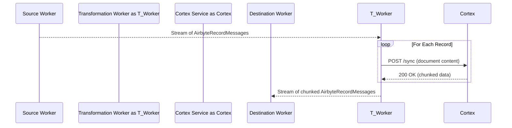

# Airbyte Cortex Service

[](https://github.com/<your-username>/airbyte-cortex-service/actions/workflows/ci.yml)

A production-grade microservice for intelligent, in-flight pre-processing of unstructured data, making it AI-ready for RAG pipelines in Airbyte.

## Overview

Airbyte is a leader in data movement, but creating production-grade RAG pipelines requires more than just moving data. It requires sophisticated, in-flight transformation of unstructured data into semantically coherent chunks.

The Cortex service solves this "last-mile" problem by providing a robust, configurable API for intelligent chunking and semantic validation, designed to be integrated directly into the Airbyte data flow.

## Business Impact

- **ACV Expansion:** Enables 25-50% premium pricing on enterprise tiers through advanced AI-ready data transformation capabilities
- **TAM Capture:** Positions Airbyte to capture 2-4% of the $14.7B AI-ready data preparation market
- **New Revenue Streams:** Unlocks consumption-based pricing models for data transformation, similar to dbt Labs' successful monetization strategy

## ✨ Features

- **Configurable Chunking:** Multiple chunking strategies (`paragraph`, `fixed_size`) via API configuration
- **Semantic Validation:** Cosine similarity scoring between chunks for contextual coherence measurement
- **Production Ready:** API key authentication, structured logging, and Prometheus metrics endpoint (`/metrics`)
- **Containerized:** Docker packaging for reproducible deployments

## Architecture

Cortex is a stateless, containerized microservice designed as an in-flight transformation step within the Airbyte data pipeline. It processes unstructured content and returns semantically coherent chunks optimized for RAG applications.



## 🚀 Getting Started

### Prerequisites

- [Docker](https://www.docker.com/get-started)
- [Docker Compose](https://docs.docker.com/compose/install/)

### 1. Set Up Environment

Clone the repository and create a `.env` file:

```bash
git clone https://github.com/minhkhoango/airbyte-cortex-service.git
cd airbyte-cortex-service
cp .env.example .env
```

### 2. Run the Service

Launch the service:

```bash
docker-compose up --build
```

The API will be available at `http://127.0.0.1:8000`. View the OpenAPI documentation at `http://127.0.0.1:8000/docs`.

### ⚙️ API Reference

The primary endpoint is `/api/v1/sync`. All requests must include the `X-API-Key` header.

Example `curl` Request:

```bash
curl -X POST "http://localhost:8000/api/v1/sync" \
-H "Content-Type: application/json" \
-H "X-API-Key: your-secret-key-here" \
-d '{
  "document_id": "doc-xyz-789",
  "content": "This is the first paragraph.\n\nThis is the second.",
  "metadata": { "source": "s3-bucket" },
  "chunking_strategy": {
    "name": "paragraph",
    "params": { "min_chunk_size": 10 }
  }
}'
```
